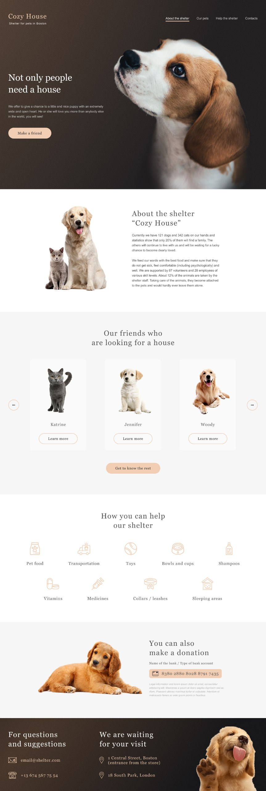
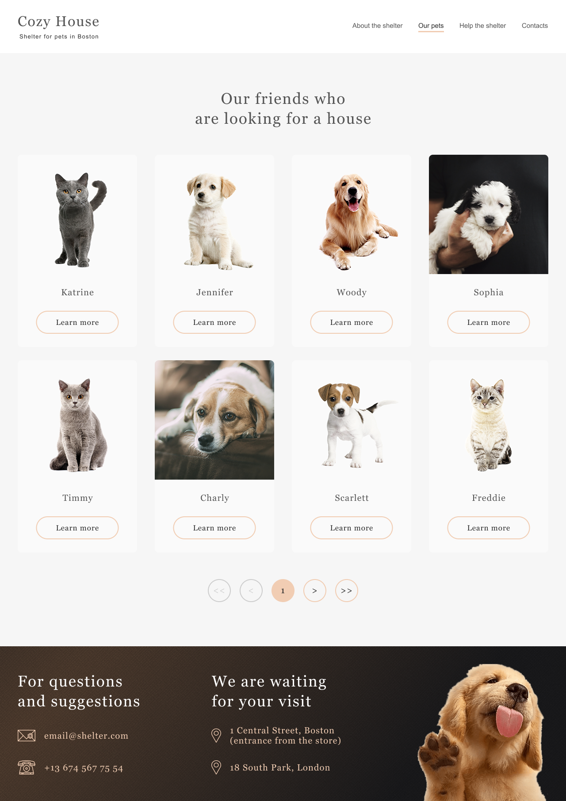

# Cozy House

## Описание
**Cozy House** — это адаптивный сайт для отображения карточек с питомцами. Сайт содержит главную страницу и страницу с дополнительной информацией о питомцах. Реализован с использованием HTML, CSS и JavaScript.

---

## Структура файлов
Проект имеет следующую файловую структуру:

```plaintext
Shelter: Cozy House(root)
│
├───assets
│   └───images              # Изображения, используемые на сайте
│       ├───Card images     # Изображения для карточек питомцев
│       └───List items      # Изображения для списка товаров
│
├───pages
│       index.html          # Главная страница
│       pets.html           # Страница с информацией о питомцах
│
├───scripts
│   │   index.js            # Скрипт для главной страницы
│   │   pets.js             # Скрипт для страницы питомцев
│   │   
│   └───modules             # Модули JavaScript
│           cards.js
│           cardsModal.js
│           elementCache.js
│           menuAndSidebarHandlers.js
│           petsInfo.js
│
└───styles
        index.css           # Стили для главной страницы 
        pets.css            # Стили для страницы питомцев
```

---

## Как запустить проект?

### Локальный запуск:
1. Убедитесь, что у вас установлен любой локальный сервер, например [Live Server](https://marketplace.visualstudio.com/items?itemName=ritwickdey.LiveServer).
2. Откройте проект в вашем редакторе кода (например, VS Code).
3. Перейдите в папку `Pages`. Щёлкните правой кнопкой мыши на файле `index.html` и выберите **"Open with Live Server"**.
4. Проект запустится в вашем браузере.

### Альтернативный способ:
1. Убедитесь, что у вас установлен Node.js и npm.
2. Установите `live-server` глобально:
   ```bash
   npm install -g live-server

---

## Превью сайта

### Главная страница


### Страница питомцев


---

## Макет
Сайт сверстан по [макету](https://www.figma.com/design/cBQ8fxYltmqj0515unJcQW/Shelter?node-id=94-43&node-type=canvas&t=LxwvYohD0A9iJDKL-0) из Figma.